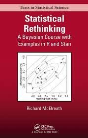
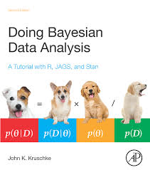
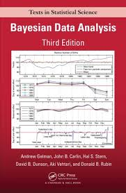
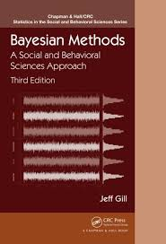

```{r setup, include=FALSE}
knitr::opts_chunk$set(echo = FALSE, warning = F, message = F, fig.width = 6, fig.height = 4)
```

## Class information

- **Instructor**: Wiktor Soral, PhD
- **E-mail**: wiktor.soral@psych.uw.edu.pl
- **Office**: room no. 96
- **Office hours**: Thursday, 1-3PM

## Course outline

- Intro to Bayesian thinking
- Intro to Bayesian computation with R
- Intro to Markov Chain Monte Carlo
- Bayesian linear models: 
  - simple and multiple regression
  - Bayesian factorial ANOVA
- Bayesian generalized linear models: logistic and Poisson regression
- Bayesian multilevel models
- Practices in model building: model comparison and model averaging

## Assessment methods:

- Midterm exam (around November 25, 2019)
- Final exam (January 27, 2020)
- Home assignments (around 10)

**Final score** = 30% * (midterm score) + 40% * (home assignments) + 30% * (final exam score) 

Total score and both exam scores should be at least at the 50% level to pass the course.

## Attendace rules

Students are allowed to miss 2 classes without excuse, 2 more classes in case of excuse, but will not pass the course in case of more than 4 absences. 

Additional work is assigned in case more than 2 classes are missed (even in cases of valid excuse).

## Course website

[https://github.com/wsoral/bam_2019](https://github.com/wsoral/bam_2019)
  
  
## Typology of statistics

- **Frequentists:** From Neyman, Pearson, Wald. An approach you learned during basic statistics course. Is based on an imaginary sampling distributions and sharp decisiton rules (NHST = Null Hypothesis Significance Testing).

- **Bayesians:** From Bayes/Laplace/de Finetti. An approach that recently gains increasing popularity. Is based on an assumption that our knowledge regarding parameters in uncertain and can be always updated by new data. 

## Conceptually, Bayesian models are simple

Posterior probability $\propto$ Data probability $\times$ Prior probability

## Conceptually, Bayesian models are simple, example 

- A researcher is interested in differences in empathy between men and women. No past research examined this relationship.
- The researcher believes that the hypothesis that men are more empathic than women is just as likely as the hypothesis that women are more empathic than men (**prior**).
- Then the researcher conduct a study, and finds that in the collected sample women score higher on the empathy measures than men (**data**).
- The researcher updates his/her belief, and now finds hypothesis that women are more empathic than men more likely than the reverse (**posterior**).

## Critical differences between Bayesian and Non-Bayesians: *Fixed/Variable*

- **Frequentists:** Data are random IID sample from a continuous stream, but parameters are fixed.

- **Bayesians:** Data are observed and therefore fixed, but parameters are unknown and described distributionally.

## Critical differences between Bayesian and Non-Bayesians: *Fixed/Variable*

```{r}
library(tidyverse)
tibble(x = 5.4) %>% 
ggplot(aes(x))+
  geom_vline(aes(xintercept=x), size=2, colour = 'lightblue')+
  labs(x='Difference between men and women')+
  scale_x_continuous(limits = c(3,8))+
  ggpubr::theme_pubr()
```

## Critical differences between Bayesian and Non-Bayesians: *Fixed/Variable*

```{r}
tibble(x = rnorm(100, 5.4, 0.4)) %>% 
ggplot(aes(x))+
  geom_density(fill = 'lightblue')+
  labs(x='Difference between men and women', y = 'Density')+
  scale_x_continuous(limits = c(3,8))+
  ggpubr::theme_pubr()
```

## Critical differences between Bayesian and Non-Bayesians: *Interpretation of probability*

- **Frequentists:** Probability is observed result from an infinite series of trials performed under identical conditions.

- **Bayesians:** Probability is the researcher 'degree of belief' before or after the data are observed.

## Critical differences between Bayesian and Non-Bayesians: *Model summaries*

- **Frequentists:** Point estimates and standard errors. Confidence intervals: 95% CI indicating that 19/20 times intervals covers the true parameter value.

- **Bayesians:** Various ways of describing parameters distribution (means, medians, quantiles). Credible intervals, HPDIs (highest posterior density intervals).

## Critical differences between Bayesian and Non-Bayesians: *Model summaries*

```{r}
genSE <- function(n = 100, mu = 2, sd = 1) {
  x = rnorm(n, mu, sd)
  m = mean(x)
  se = sd(x)/sqrt(n)
  list(m, se)
}
set.seed(345)
result <- unlist(replicate(20, genSE(),simplify = T))
result <- as_tibble(matrix(result, nrow=20, byrow = T))
colnames(result) <- c('M','SE')

result %>% 
  rownames_to_column() %>% 
  rename(replication = rowname) %>% 
  mutate(replication = as.numeric(replication)) %>% 
  mutate(lower = M - 1.96*SE, upper = M + 1.96*SE) %>% 
  ggplot(aes(x=M, y=replication))+
  geom_vline(xintercept = 2, colour='lightblue')+
  geom_point()+
  geom_segment(aes(y=replication, yend=replication,
                   x = lower, xend = upper))+
  scale_y_continuous(breaks=1:20)+
  labs(x='Difference between men and women')+
  ggtitle('Replication means and 95% confidence intervals')+
  ggpubr::theme_pubr()
```

## Critical differences between Bayesian and Non-Bayesians: *Model summaries*

```{r}
x = rnorm(200, 2, 1/sqrt(100))

tibble(y="HPDI",
       l1 = quantile(x, probs = 0.025),
       l2 = quantile(x, probs = 0.10),
       l3 = quantile(x, probs = 0.33),
       l4 = quantile(x, probs = 0.66),
       l5 = quantile(x, probs = 0.90),
       l6 = quantile(x, probs = 0.975)) %>% 
  ggplot()+
  geom_segment(aes(y=y, yend=y,
                   x = l1, xend = l6,
                   colour = "95%"), size = 3, lineend = "round")+
  geom_segment(aes(y=y, yend=y,
                 x = l2, xend = l5,
                 colour = "90%"), size = 3, lineend = "round")+
  geom_segment(aes(y=y, yend=y,
                 x = l3, xend = l4,
                 colour = "66%"), size = 3, lineend = "round")+
  labs(x='Difference between men and women', y="",
       colour="")+
  ggtitle('Bayesian Intervals')+
  scale_color_brewer(palette = "Set2")+
  ggpubr::theme_pubr()
```

## Critical differences between Bayesian and Non-Bayesians: *General inference*

- **Frequentists:** Deduction from the data given $H_0$, by setting $\alpha$ in advance. Reject $H_0$ if $Pr(data | H_0) < \alpha$, not reject $H_0$ if $Pr(data | H_0) \geq \alpha$.

- **Bayesians:** Induction from posterior given prior knowledge.


## Critical differences between Bayesian and Non-Bayesians: *General inference*

```{r}
tibble(x1=seq(-1.96,1.96, length.out = 100),
       y1=dt(x1, df=8),
       x2=seq(-4,-1.96, length.out = 100),
       y2=dt(x2, df=8),
       x3=seq(1.96,4, length.out = 100),
       y3=dt(x3, df=8)) %>% 
ggplot()+
  geom_area(aes(x=x1,y=y1, fill="H0"), colour="black")+
  geom_area(aes(x=x2,y=y2, fill="H1"), colour="black")+
  geom_area(aes(x=x3,y=y3, fill="H1"), colour="black")+
  annotate("text",x=1.96, y=dt(1.96,8)+0.01, label = "Critical p-value = .05")+
  annotate("text",x=-1.96, y=dt(1.96,8)+0.01, label = "Critical p-value = .05")+
  geom_vline(xintercept = 3, linetype=1, size=1.5)+
  geom_vline(xintercept = 1.3, linetype=2, size=1.5)+
  scale_fill_brewer(palette = "Set2")+
  labs(x="Difference between men and women", y="", fill="")+
  ggpubr::theme_pubr()
```


## Critical differences between Bayesian and Non-Bayesians: *General inference*

```{r}
library(bayestestR)
set.seed(123)
data <- rnorm(1000, 2, 10/sqrt(10))
x <- p_direction(data)
plot(x, show_labels=T)+
  geom_text(aes(x=4, y = 1.3, label="76.3%"), colour="white", size=5)+
  geom_text(aes(x=-1.3, y = 1.3, label="23.7%"), colour="white", size=5)+
  ggpubr::theme_pubr()+
  labs(x="Differences between men and women")+
  scale_fill_brewer(palette = "Set2")
```

## Critical differences between Bayesian and Non-Bayesians: *General inference*

```{r}
x2 <- rope(data, range = c(-1,1))
plot(x2, show_labels=T)+
  ggpubr::theme_pubr()+
  labs(x="Differences between men and women")+
  scale_fill_brewer(palette = "Set2")
```


## Critical differences between Bayesian and Non-Bayesians: *General inference*

```{r}
prior <- distribution_cauchy(1000, 0, scale = 1/sqrt(2))
posterior <- distribution_normal(1000, mean = 2, sd = 7/sqrt(100))
bf <- bayesfactor(posterior, prior=prior)
plot(bf)+
  ggpubr::theme_pubr()+
  scale_color_brewer(palette= "Set2")+
  scale_fill_brewer(palette = "Set2")+
  labs(x="Differences between men and women")+
  ggtitle("Bayes Factor, BF = 45.28")
  
```


## Critical differences between Bayesian and Non-Bayesians: *Quality checks*

- **Frequentists:** Type I and type II errors. Effect size and power. Fixation on p-values.

- **Bayesians:** Posterior predictive checks. Sensitivity to forms of the prior. Bayes factors, information criteria (DIC, WAIC, LOOIC).

## Software for Bayesian modeling

- Majority of contemporary software offer functionalities for Baysian analysis
- Stata
- SAS
- MPlus
- SPSS/Amos
- JASP
- WinBUGS
- **R**
  - JAGS
  - **Stan**
  - **brms**
- Python - Pymc3
- Julia - Turing

## Books on Bayesian analysis




## Books on Bayesian analysis



## Books on Bayesian analysis



## Books on Bayesian analysis



## Books on Bayesian analysis


## Online resources:

- List of blog posts about brms on Paul Bürkner site: [here](https://paul-buerkner.github.io/blog/brms-blogposts/)
- Case studies using Stan: [here](https://mc-stan.org/users/documentation/case-studies.html)
- A. Solomon Kurz online book with examples from Statistical rethinking translated into brms: [here](https://bookdown.org/connect/#/apps/1850/access)
- A. Solomon Kurz online book with examples from Andrew Hayes (mediation and moderation analysis) book translated into brms: [here](https://bookdown.org/connect/#/apps/1850/access)
- A. Solomon Kurz online book with examples from Kruscke book translated into brms: [here](https://github.com/ASKurz/Doing-Bayesian-Data-Analysis-in-brms-and-the-tidyverse)

